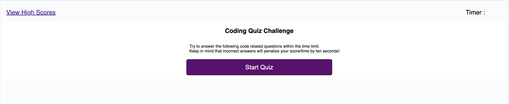
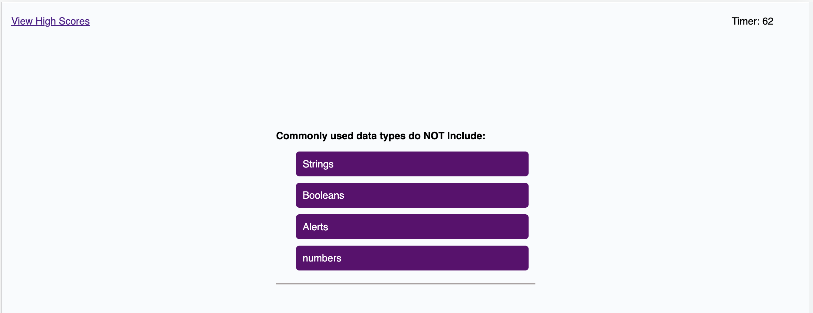
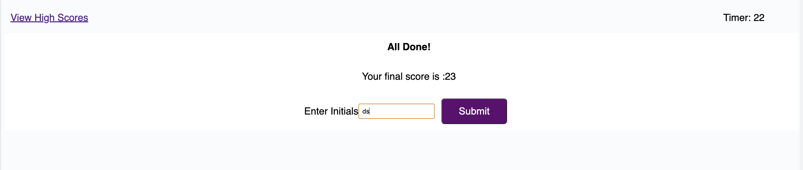
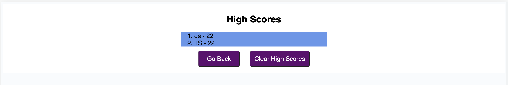

# code-quiz
A timed coding quiz with multiple-choice questions. This app features dynamically updated HTML and CSS powered by JavaScript code.

# code-quiz Webpage

Link to Deployed Application;
https://tasshroll.github.io/code-quiz

Link to GitHub repository:
https://github.com/tasshroll/code-quiz


SCREENSHOTS of application beginning, middle, end, and highscores page

Start Page


Middle Page


End Page


High Scores Page


## Description
This Application generates a timed coding quiz with multiple-choice questions. This app will run in the browser and will feature dynamically updated HTML and CSS powered by JavaScript 


## User Story
```
AS A coding boot camp student
I WANT to take a timed quiz on JavaScript fundamentals that stores high scores
SO THAT I can gauge my progress compared to my peers
```

## Acceptance Criteria

```
GIVEN I am taking a code quiz
WHEN I click the start button
THEN a timer starts and I am presented with a question
WHEN I answer a question
THEN I am presented with another question
WHEN I answer a question incorrectly
THEN time is subtracted from the clock
WHEN all questions are answered or the timer reaches 0
THEN the game is over
WHEN the game is over
THEN I can save my initials and my score
`````

## Other

- What was your motivation? 

To use setattribute to hide and show sections of the web page

Store and retrieve data using the browser's local and session storage. (JSON parse & stringify)

To use multiple event listeners to control application flow

To use id's to assist with key presses and DOM traversal for retreiving and writing data

Select and dynamically generate HTML elements and content using Web API methods

To use media queries to build responsive display

Identify the DOM and its relationship to HTML.


- Why did you build this project? 
I built this project to utilize the above functionality to create the app.

- What did you learn?
I learned the process of app development: Analyze the mockup, write pseudo code, develop functions to create each section, Test & debug, refactor, document. I learned more about global and local variables and event listeners. 

## Installation 
N/A

## Usage
Click the main Generate Password button and answer the prompts.

## Credits
N/A
Ask BCS, BC tutors

## License
Please refer to the LICENSE in the repo.

## Badges
N/A

## Features
N/A

## How to Contribute
N/A

## Tests
N/A